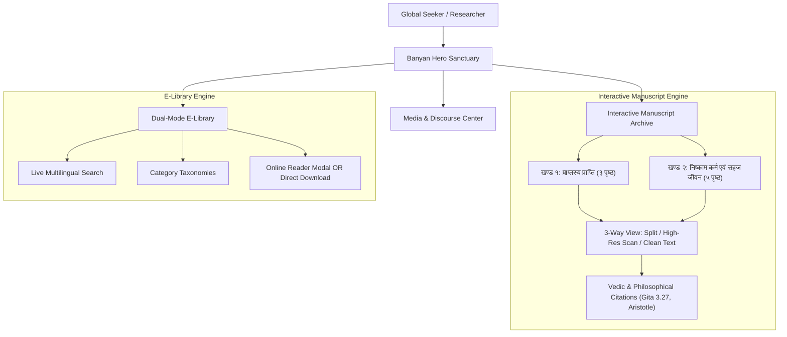

# प्राप्तस्य प्राप्ति (Praptasya Prapti)

**Digital Archive, Philosophy Portal & Sovereign Publishing Platform**  
*Crafted by [Chiti Technologies](https://chiti.com)*

---

## Executive Overview

**Praptasya Prapti** (*"Attaining That Which is Already Attained"*) is an enterprise-grade digital knowledge sanctuary and literary repository designed for the life work, manuscripts, and philosophy of **Shri Harnarayan Sah** (*pen name:* **Anantanand Manav**, *Manav Mukti Manch*).

Commissioned as a permanent intellectual legacy platform, this system bridges profound ancient Indian wisdom—spanning the Upanishads, Bhagavad Gita, and indigenous Gondi traditions—with cutting-edge modern digital engineering. It provides global readers with an uncompromised dual capability: **immersive in-browser study** and **high-resolution archival preservation**.

---

## The Design Philosophy: "Sanctuary of Consciousness"

Built in accordance with the **Chiti Technologies Unified Design System**, the visual language eschews generic corporate templates in favor of a bespoke, organic aesthetic tailored for timeless contemplative study:

### 1. Organic Sacred Palette
- **Deep Maroon (`#661b1c` / `#4a1213`):** Symbolizing spiritual gravitas, classical Indian binding cloth, and ancient temple sanctums.
- **Saffron & Antique Gold (`#b85d19` / `#d49a3d`):** Representing enlightened inquiry, dawn of knowledge (*सूर्योदय*), and philosophical illumination.
- **Parchment & Handcrafted Paper (`#f7f3ea` / `#eee5d3`):** Evoking warm, tactile handmade Bhojpatra and archival cotton paper for strain-free reading.
- **Deep Forest Ink (`#1a1612` / `#0d1c16`):** High-contrast, mathematically balanced typography for effortless prolonged reading.

### 2. Typographic Craft
- **Tiro Devanagari Hindi:** Elegantly rendered Devanagari letterforms preserving traditional conjuncts, vowel matras, and Sanskrit diacritical marks.
- **Martel:** A sturdy, humanist serif typeface designed specifically for complex multilingual texts, providing editorial clarity across Hindi and English.
- **Mukta:** A clean, geometric Indian grotesque sans-serif for responsive UI controls, filters, and digital metrics.

### 3. Cultural Motifs & Sacred Geometry
- **Gondi Folk Art Vectors:** Hand-crafted SVG motifs integrating trees of life, birds, and community circles honoring India's indigenous cultural heritage.
- **Interactive Temple Seal:** A circular responsive medallion framing the author's legacy at the apex of the digital sanctum.

---

## Architectural Highlights & UX Innovations



### A. Dual-Volume Interactive Manuscript Engine
The platform preserves original ink leaves penned by the author through a bespoke multi-mode viewer (`ManuscriptSection`):
- **Volume 1: प्राप्तस्य प्राप्ति (3 Pages):** The foundational Vedantic Mahavakya (*Ishopanishad*), the coin parable, Gondi & Sanatan indigenous way of life, and the universal thesis.
- **Volume 2: निष्काम कर्म एवं सहज जीवन (5 Pages):** Critical philosophical treatise on *Bhagavad Gita 3.27*, natural spontaneous action vs dogmatic rituals (e.g., the Tuesday fasting parable), the dawn of truth, and a critical rebuttal of Aristotle's claim that *"man is inherently selfish"*.
- **Tri-Mode Reading Experience:**
  1. **तुलनात्मक दृष्टि (Split Comparison View):** Side-by-side juxtaposition of the raw handwritten manuscript scan and modern Devanagari typography.
  2. **मूल स्कैन (High-Precision Scan View):** Dynamic zoom controls (`1x` to `2.5x`) with pan/drag and instant high-res JPEG downloads.
  3. **डिजिटल पाठ (Extracted Digital Text):** Verified text enriched with scripture badges, conceptual summaries, and core conclusions.

### B. High-Performance Digital E-Library (`PdfRepository`)
- **Instant Search:** Real-time keyword filtering indexing titles, summaries, and tags in both Hindi and English.
- **Taxonomy Filters:** Instant categorization spanning Core Books, Original Manuscripts, Biographies, Essays, Culture, and Stories.
- **Dual-Action Workflow:** Every document offers an instant in-browser preview modal (`PdfModal` / `PdfReader`) or a 1-click direct download with exact file sizes displayed.
- **Client-Side ZIP Generation:** Integrated `jszip` engine enabling single-click bundle downloads for offline distribution.

### C. Zero-Dependency Single-File Bundling
Configured with `vite-plugin-singlefile`, allowing the entire application, CSS, fonts, and logic to compile into a single self-contained, lightning-fast distribution file. This allows:
- Direct deployment to any edge CDN (Vercel, Cloudflare, Netlify, AWS S3).
- Offline air-gapped distribution via USB / local storage for academic institutions and ashrams.

---

## Technical Stack

| Layer | Technology | Architectural Rationale |
|---|---|---|
| **Core Framework** | React 19 | High-performance reactive rendering with modern compiler optimizations |
| **Language** | TypeScript 5 | End-to-end type safety across literary and multimedia schemas |
| **Build & Tooling** | Vite 7 | Sub-second HMR and optimized production treeshaking |
| **Single-File Bundle** | `vite-plugin-singlefile` | Production distribution inlining for zero-latency instant loading |
| **Styling** | Tailwind CSS v4 | Modern CSS variables, container queries, and sub-pixel typography |
| **Animation Physics** | Framer Motion | Smooth viewport-triggered entrances and tactile micro-interactions |
| **Iconography** | Lucide React | Clean, scalable 24px icon vectors styled with theme accents |
| **Document Processing**| `pdfjs-dist` + `jszip` | High-fidelity client-side PDF rendering and batch packaging |

---

## Getting Started

### Prerequisites
- **Node.js:** `v22.x` or higher
- **Package Manager:** `npm` (v10+ or v11+)

### Installation & Local Development

```bash
# 1. Clone repository
git clone https://github.com/prabhakarmdes12-cmyk/praptasya-prapti.git
cd praptasya-prapti

# 2. Install dependencies
npm install

# 3. Start local development server
npm run dev
```

Visit [http://localhost:5173](http://localhost:5173) in your browser.

### Production Build

```bash
# Compile and bundle into production dist/
npm run build

# Preview production build locally
npm run preview
```

---

## Enterprise Showcase: What Chiti Technologies Delivers

When you partner with **Chiti Technologies** to digitize, publish, and scale intellectual property, cultural archives, or corporate literature, you receive:

1. **Sovereignty & Longevity:** No lock-in to proprietary CMS subscriptions or bloated page-builders. Your content lives in clean TypeScript structures and open standards.
2. **Archival Precision:** Preservation of original physical artifacts alongside machine-readable, indexable, SEO-optimized typography.
3. **World-Class Visual Identity:** Custom-crafted design systems that honor the soul and cultural context of your organization.
4. **Flawless Multi-Device Performance:** Fluid responsiveness from high-resolution 4K desktop displays to low-bandwidth mobile handsets.

---

## Authorship & Attribution

- **Author & Thinker:** Shri Harnarayan Sah (*अनन्तानन्द मानव*)
- **Movement:** Manav Mukti Manch (*मानव मुक्ति मंच*)
- **Engineering & Design:** [Chiti Technologies](https://chiti.com)
- **License:** All philosophical texts and manuscripts © Shri Harnarayan Sah. Software engine licensed under MIT.
